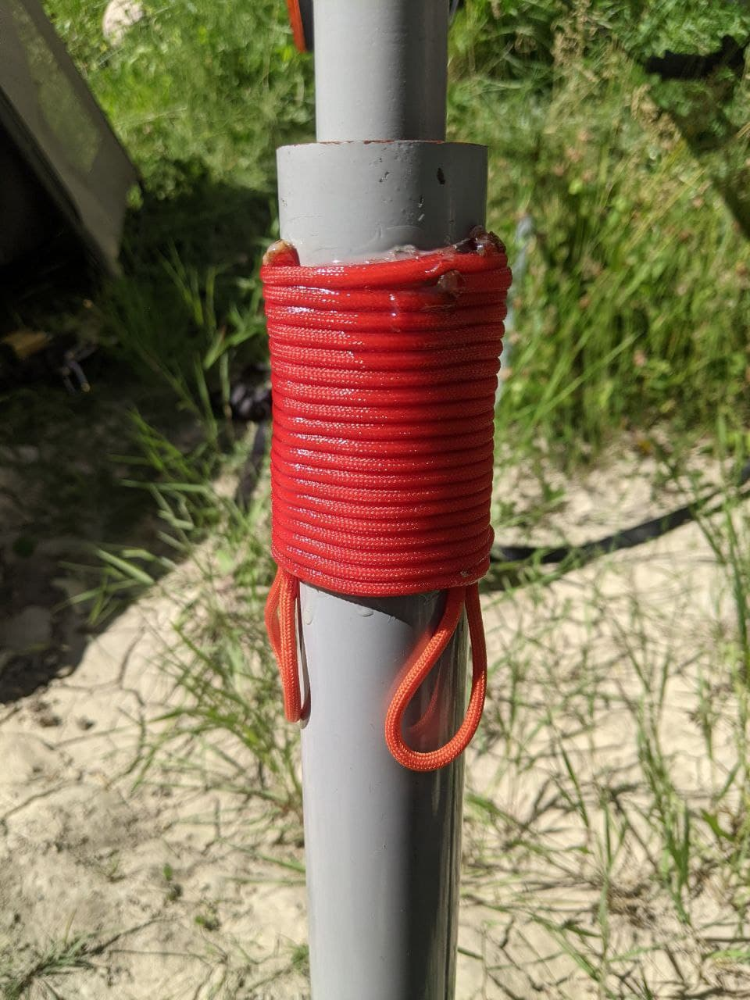

After my last successful activation, I was thrilled to start again with a new, more challenging one.
Activating from my van is quite easy, but packing everything up in a bag is something I haven't done in years.

_SPOIL ALERT:_ I'm holding the SOTA flag upside down, and that is on purpose... Read more to discover why.

# Planning

We are currently in the Verdon regional park. In a quiet place near a river, surrounded by mountains. It took us a few hours to feel
the urge to move and climb them. That's when I open my laptop and start to see what we could do on radio around.

There is no easy treks around, but I can see a few valid summits and all of them are in a WWFF. That's perfect!

I started to plan the hike on my desktop to evaluate the difficulty and the "easiest" one is at 1741m, with an elevation gain of 900m for 5km. That's quite more than we are used to, since we are not in our best shape, but we like challenges!

The plan is accessible on [Outdooractive](https://www.outdooractive.com/en/route/hiking-route/access-to-sota-f-am-389/214926247/?share=%7Ezqvdsmmg%244ossiftc)

# Preparation

Since it's been a while I haven't activated outdoors (that means out of the van), I had to check everything up again. It took me many hours to test the material, prepare paper log sheets and make my radio work out of the van installation. 

Also, upgrade the mast so I can make it stand without any pole / tree support. I took the idea from [K6ARK](https://www.youtube.com/watch?v=RqnDtY-iEDw)

One fun thing I had to do, is to cut the RJ11 cable that connects the front panel of my FT-857D to the TX and rewire them one by one, with soldering works and heat shrink work. That seems odd, but when you are on the road in the middle of nothing, you gotta find solutions with what you have.

I double "eye-check" my stuff before packing and everything seems fine. So I feel prepared. Just need to charge the phone and tablet during the night.

# Let's do it

In the morning, we are quite unorganised. We don't eat anything but a banana, and grab a couple snacks for the road, thinking we'll be back before midday. Also, I forgot to drink enough to avoid getting thirsty after 30m walking.

We didn't think about the fact that if we go with the Vespa to the beginning of the path, we'll have to carry the helmets. And adding 45 minutes walking to the trip is not in our plans. So we decided to drive helmet free, since it's a very quiet area. A "dolce vita" feeling.

We park the vespa and ready to start walking. No rest, the elevation is already strong and there is no descent AT ALL. The path is messy, no indication whatsoever.

The climbing is quite hard, we had to slow down and drink carefully to be able to do it with our physical condition.

Seeing the summit from down there was discouraging a bit, but the mental worked great because in most hikes, I am are surprised at the end how harder it seems when you are at the bottom.

It was indeed hard, but you feel so great when you're on the top of the summit. We screamed of joy!

# Setting up

The sun was hitting hard, it was around 11am. But the wind was enough to keep us chill. I start to plug the radio onto the battery and realise instantly my major mistake.

__I FORGOT THE MIC__

What a shame. What a noob I told myself. Gosh....

I tested everything yesterday, but didn't transmit so didn't need the mic. It was still in it's everyday location in the van. I was so ashamed.

Whatever, I decided to take this climb as a lesson and an exercise. I started to raise the antenna and make sure everything worked fine except for the transmission. And indeed, I could hear 2 SOTA on 40M, from OM that didn't FORGET THEIR MICS. 

I tried to make a few contacts on VHF but this summit is surrounded by mostly other summits and no civilisation in sight. The chances for making 4 contacts were very very poor. And that's how I shut down the UV-5R with 0 ITL.

# Going down

Returning was hard, harder then we thought. We spent the same time walking downward than climbing (~2h30). The heavy bag cointaining all the QRO stuff (40Ah lithium battery, FT-857D, iPad, Antenna etc.) of approx. 20kg was doing it's job on my knees. Hard hit every step.
We did it, tired as we rarely been, but still satisfied of the trip. Crazy view, crazy challenge, we did it and did it well if not counting the major mistake.

# Lessons learned

- Make a strong checklist for the bag
- Eat and drink well in the morning
- Protect your legs in dry mountains, the flora is not very welcoming
- Bring repulsive for ticks, fire flies etc.
- Think of sun protection, even if the weather is colder, the sun was hitting hard
- Bring more snacks in case of extended duration (why not plan for a second summit)
- Think of a first aid kit in case of something bad happen (it could have happened on this one)
- BRING THE MIC

I hope you enjoyed reading this sad but funny story, and I hope to succeed on my next SOTA. This will clearly not discourage me and we are ready to find new SOTA to make.

A big high five to the Mountain Goat F5LKW for activing this summit in 2011 with 3 more on the same day. I've seen where they've been, and that's remarkable, at least for me. I wish I could renew it but that's not happening.

Best 73 to all readers de F4IXL/P

