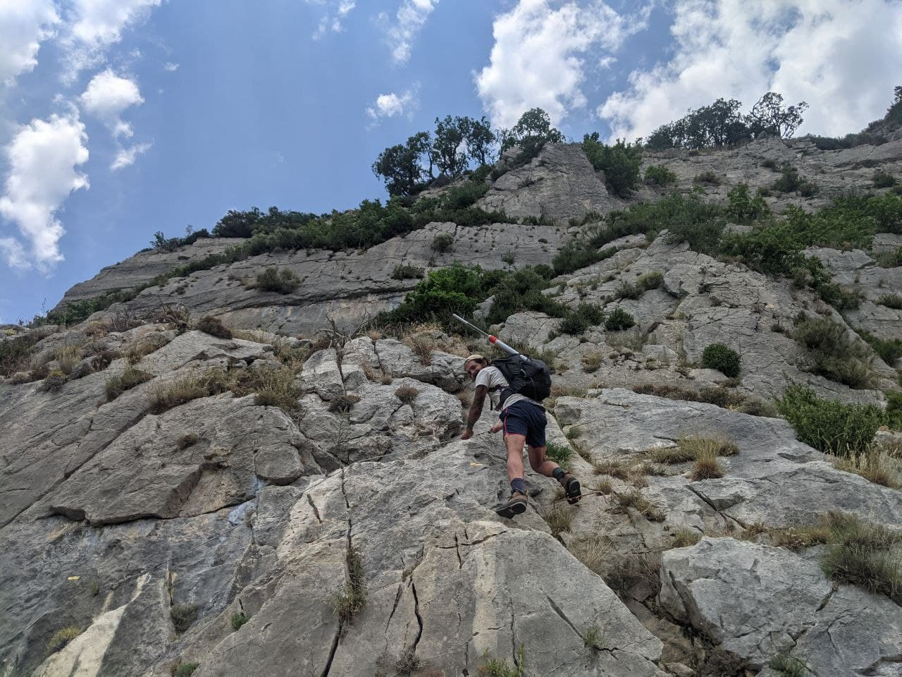

This time I am allowed to proudly hold the flag straight, this is my first successful SOTA, my first 2 points as an activator and also my first S2S (Summit to Summit). I almost failed a second time. Story time.

# Planning

You may have [read about my first and last try at activating a SOTA](/report-why-i-failed-at-my-first-sota-f-am-389-fff-106/) and it has been a complete failure, missing a major component in my gear. Well, I was super hype about trying again FAST, to avoid losing motivation and live with this failure without turning it into a success.

My body was still recovering from the 900m ascent and we moved in a cute city called Sisteron. As soon as I stepped out of the van, my eyes go directly to the surrounding summits. I was obssessed with climbing again. I was visually analysing the ascent, the flaura and trying to find any visible hike paths.

I went on the computer and open sotlas and my hike planner to find all the possible summits we could do without moving any vehicule.

The closest one was a 1 point and the hike seems a bit boring, lot's of trees probably blocking the view. The second one, was the predominant rock of the city, looks way more appealing and it's a 2 points. Last activation in 2016, good enough for a start.

So, the shortest path to the summit is 3.4km for a 600m ascent. That is way lower than the last attempt and my recovering body is okay with this compromise.

One of my friend was supposed to come with me the next morning but injured himself on his ankles, so YL offered to come with me again.

# Next morning

Waking up at 7, quite harsh since we had the great idea to have a few beers in town the night before. We aren't well prepared, but we still start moving around making minimal stuff ready.

My checklist is this time complete, but just to make sure, I want to try the radio before leaving. Even if the radio is reliable, since I had a hard time starting it on last summit, I was anxious about failing another time.

And guess what. The radio is not working, AT ALL. Impossible to start it. I press the power button of my FT-857, I hear a "click" but it doesn't start. So I told YL we could go back to bed, this was a false start. I was so angry, why are those bad lucks are happening to me all of a sudden. Is there a SOTA malediction?

# Repairing the TX

I suspect my FT-857 to have a bad wiring close to the plug. I could see the radio shut down before when I move the power supply wire. I move it in every direction and I do hear some clicks, but nothing else is happening.

There is also this RJ-12 cable that I repaired myself that could be faulty, even if I was very cautious while soldering these small wires. So this might be related.

I asked on a french radio amateur group and on my profile and got some direction on what to do with my multimeter, and everything seems fine. Got my 13.5V inside the radio. Either I had to measure further inside, or take the lead of checking that RJ-12 cable.

I went to a small store doing networks and computer stuff and asks for a RJ12 cable. They almost laugh since these aren't used anymore in homes / enterprises. But they could find and cable in an old box and gave it to me for free. But while inspecting the cable on the way back, I saw it was a RJ11, which have only 4 connectors, and from memory, the FT857 needs the 6 (I once experienced that).

That indeed didn't work. On internet, ordering proper cable would take many days, these are getting rare. I was thinking of buying the connectors and find someone to crimple the cable at the right size for the FT857. But again, this would take too many time.

And then I remembered in the electrical station I made for the van, I have a RJ cable connecting the battery monitor to a shunt. BINGO. It is a nice and strong RJ12.

Plugged it to the radio, and it works again.

Phew. That was so simple, and I felt so released. SOTA is now delayed to the next day.

# SOTA day

We woke up a bit late and the weather is kind of heavy, but we decided to still go since I alerted on SOTAWatch. This serves as a motivational engagement. I feel I need a good excuse not to do it, especially since this one was already delayed once.

We walked a few kilometers more to get to the beginning of the hike path.

The way up wasn't too hard, steep but constant and easy to walk. When getting really close to the summit, things change a bit and the new challenges was appreciated because we got a bit bored by the walk. We had to climb some rocks but assured by rods forming ladders and steel cords.

We also had to make our way in a deep cave, sometimes had to get on our knees. It was quite beautiful, and we got impressed by the graffitis sometimes from the 19th century. Some were engraved, some were painted with chinese ink and other probably with an candle.

Getting on the summit was once again a relief. The view wasn't much worth it, but the trees were appreciated for the shadow, since the sun was hitting hard, it was around 12h15.

It took us 7mn to install the antenna and the radio, then I self spotted the activation on SOTAWatch in advance, time for me to eat the sandwiches we made (this time we took the time to get better prepared).

I start to call on 20m and first call is a pileup already. Good, I'm ready to work it! Many stations calling from all Europe. I get some really good reports and I am happy with that. Working a SOTA on phone with 100W is a luxury I pay with a 15kg bag, carrying a 40Ah battery.

When the pileup when silent, I try a few call on 40M with some more new stations. I went back on 20M which works best for me in general, just to give more chances to hunters, and I got plenty of more stations trying to reach me.

I could work DL1CR/P on DM/NS-125, this is my first ever Summit to Summit, I'm quite happy.

We pack everything up since we fear the downhill walk, going QRT with 39 QSOs, I believe it to be a good score for a SOTA.

# Descent

Everything went fine, we also took some risks using shortcuts, we made it in an hour or so. We watched video before on how to properly going downhill without hurting joints, since we suffered on the last one (especially with that heavy backpack). We made it quick at good pace. Only the last mile was hard and I felt I could hurt myself, my legs were not so strong and my ankles really soft. I used a wood stick to help me a bit.

We had no more water and this was hard, we were craving a source or fresh water, but nothing came up until we got in town.

Once in town, we filled up in water and went to a bar to drink an iced coffee and a pint of beer. Yup, that's how we do it and that might not be the best way to recover but it was a very good moment!

# Lessons learned

- Bring more water
- Warm ankles and legs (we did it and it helped a lot)
- Leave earlier
- Bring first aid kit
- Consider gloves for more advanced hikes
- Once on air, take some time to hunt S2S!

This was a good experience overall, really happy with that first successful SOTA. I really want to thanks all of the hunters, and a special mention to F5LKW who complete this summit by activating it 11 years ago and working mine. Congratulations Roger! FORZA SOTA :)

73 all DE F4IXL/P Franco.