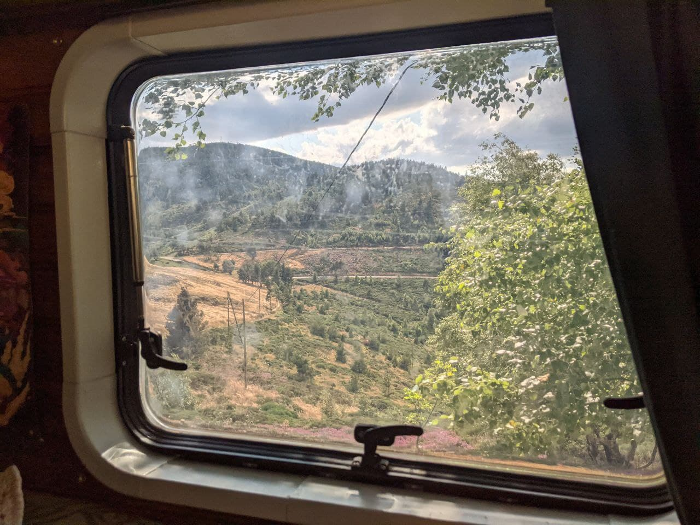

I stopped by a great point of view in the Cevennes, and doubled check that this spot is indeed 3 references in FFF program. I started by the most specific to the most general, hoping to grab more interest in specific ones, as they have more chance to be new ones to chasers.

The first one was hard to get to 44 QSO's since I started on saturday and as I reported on last activation, Saturday is not so great for us activators. The band was overloaded with contesters and chasers were absent. I almost did them all on Sunday, with great success. I could finish FFF-2666 and complete FFF-2665 and FFF-0002 in early afternoon. Last one is also the one I chose to be submitted to POTA as F-0157.

# Wind

It's the first time I am facing so much wind. I reinforced the mast with a low and a high guy and put the mast down when QRT at night. It went well, the only problem was the mast sliding down. I just had to tight it stronger and it lasted the whole activation (~4h total in 2 days).

# USA

This is always exciting to me to make new QSOs in North America, and working loyal Bob KD1CT and K1RX at 59 from New Hampshire was very exciting to me.

# More pics

Here is the view from the rolling QRA

We'll have to admit this looks unreal. The purple plant is called Heather (Bruyère cendrée) and they are everywhere here.

And to finish, here is my 10 years old daily companion, Leia.

# Lesson learned

* When activating on week-end, always prefer Sunday if you have to choose
* Choose the band according to WWFF clusters

Thanks everyone. 73 & 44 DE F4IXL/P