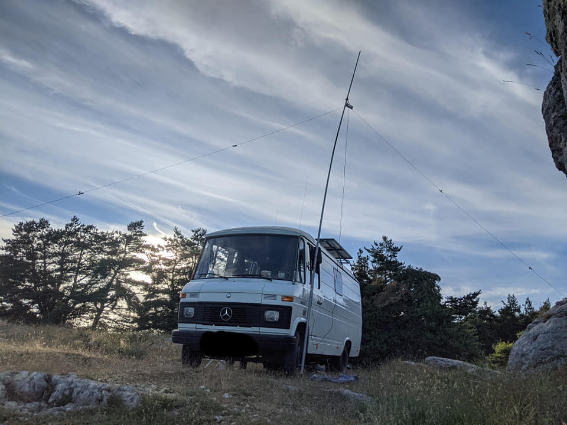
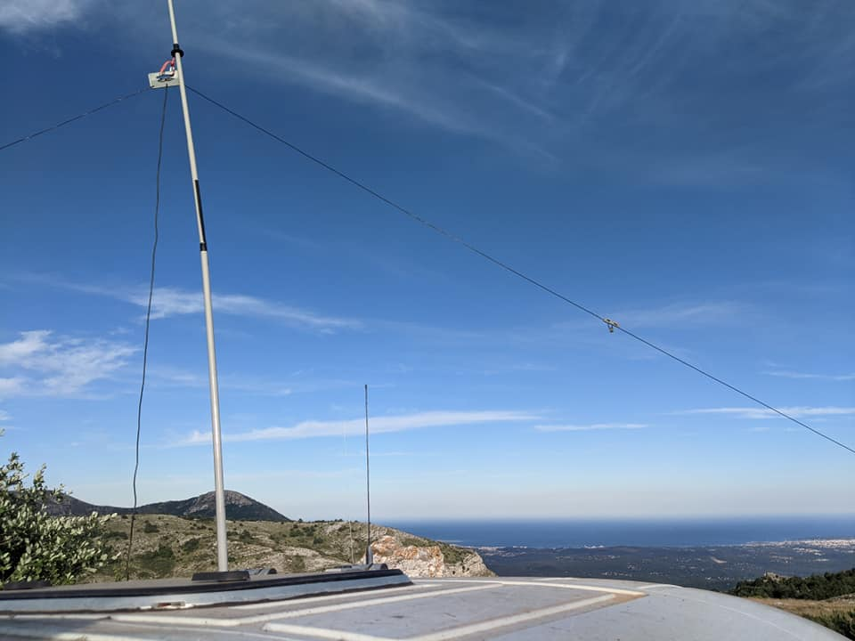
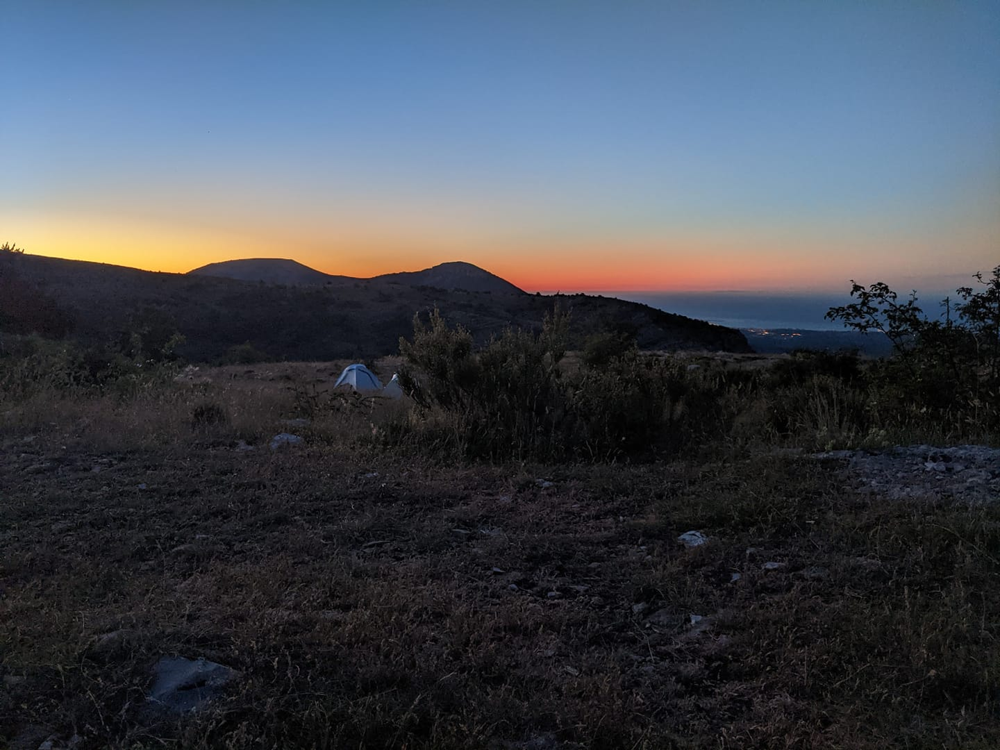

# Prelude

I've been a HAM since just a few days, but I worked ahead on my station to be effective quickly. I started radio 5 years ago on 11m and dreamt of having my radio amateur callsign since then.

As soon as I got the graal, just 2 days before Field Day, my dream activity... I set up my station near the city of Biot, close to well known city of Cannes, hoping to make many contacts with other portable stations. But I realized quickly this ARRL contest/activity is not very popular in Europe. Instead, the bands were full of Spanish contesters.

0 ITL for Field Day. I still managed to make my first few contacts in Europe and as an optimistic, I was very happy with it.

That's when I decided to change the beat and work on a successful activity. Since I'm living on the road, it's easy for me to activate nature locations and I've been interested in WWFF and SOTA since a long time.

# Chosing the spot

YL and I spent a night in Antibes, near the beach, and wanted to go up north to meet some friends in the Verdon, a very green and beautiful area. On the way there, we wanted to stop for a night on a big hill (~1000m) facing the sea and the Antibes Cape. YL offered me to chose the best spot so I could activate something to warm me up.

I found out that the area was covered by WWFF and POTA. I decided to activate both of these references.

# Activating

In about 10 minutes, I was ready to rock 20m. I felt a bit anxiety to start my call after self spotting on POTA and WWFF clusters. I realised then it was my first HAM activation, and didn't overthink until then. But hey, I'm ready. My antenna is well tuned, my radio reports were good, I know how to manage a pile-up from 11m. I will work out!

After just one call on 20m, I started to hear a pile up building up. It was so quick. I couldn't believe it, but I was the happiest working it out. The feeling of hearing all these people interested in my activation was so exciting and warming and I could start making QSO's with people I would probably start to know if they are WWFF chasers. Also, I made so many new ones I couldn't count :)

The time I was QRV was intense, 20m and 40m was busy for me, with 47 contacts. The band died quickly because it was late, but I wanted to start again in the morning, just to make the symbolic (and previous rules) count of 50 QSO's

## Early Morning

YL and I love to wake up to admire some sunrises. After watching it a few minutes, she asked me "isn't the morning the best to contact the US?". Wow, I'm so lucky I have her. Working the states is a long time dream also. And since I'm activating a POTA, which is an american program, I thought I could give it a try.

Few CQ's, well, quite a lot actually, and nothing. I saw on the clusters USA was open for Europe, I cross fingers and then, I heard an american callsign. I'm so excited, but the signal is very low and so many QRM is degrading our exchange. I struggled finding the full callsign, but the patience of Rosalida N5SUY pays off for both of us. After the Texas, I could work New York with KB2FMH, NT2A and could even work a QRP station from Masashusets, Dimitris NE1D. Most of them it was their first POTA in France, and of course a new one for them since I'm the first activating the Regional Park of Préalpes.

## After the coffee

I went to bed again and woke up around 8am. I started to call a few more CQ before wrapping up, but... It was even more crazy. Conditions were better than the day before and I filled up the log up to 127 contacts.

That's more enough for me to call it a success and a very pleasing and exciting experience.

I do not regret working on my licence to be able to live this.

Thanks to all readers, the great WWFF community and to all chasers that made this activity what it was for me. You'll hear me again.

Special thanks to Micke F4HZR who helped me since a long time and inspired me to pass the licence and activate WWFF.

Best 73 de F4IXL/P