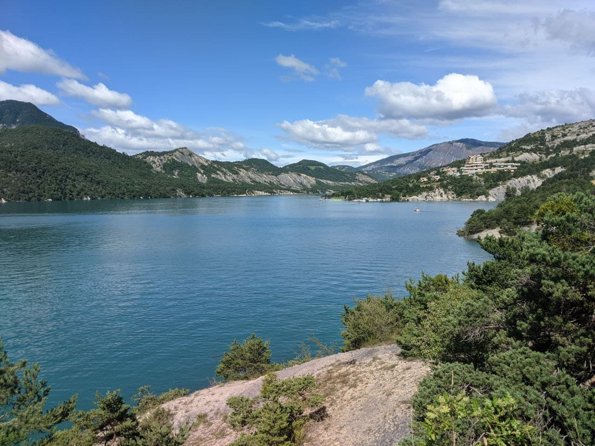
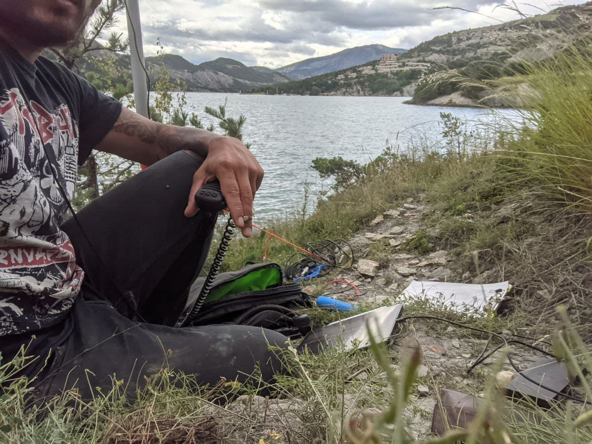
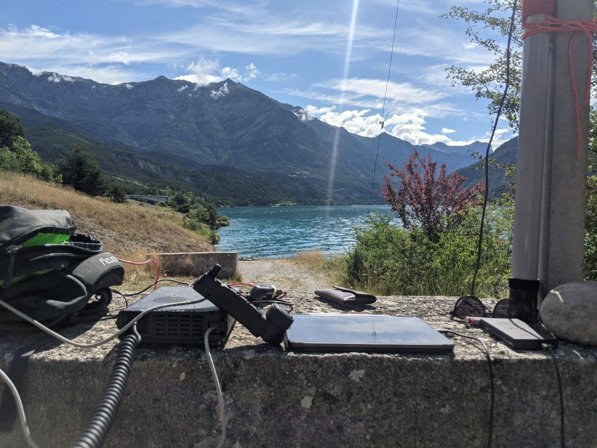

We were staying in Sisteron, the city at the feet of my last SOTA activation, when we decided to move for a few days to see different landscapes. We headed to the lake of Serre-Ponçon to meet some friends. Fortunately, there were two WWFF to activate near were we parked.

After the first night enjoying some time with friends, I decided to pack my radio and reach the side of the lake to raise the antenna.

The view was exceptional and the water crystal blue.

# FFF-1075

The first and closest to my temporary QTH was FFF-1045. I raised the pole very easily and we could swim right there. Very quiet. I worked a pile up for a while on 20m with some good conditions but it dropped suddenly.

I hopped 40m and 20m several times until I only called on an empty band. I decided to pack everything up but was unsure about the total amount of QSO's. After counting several time, __I was amused to see I got exactly 44 QSO's, not one more, not one less.__

Perfect.

I also realised my battery got pretty low, calling endlessly with 100W on a portable activity might not be the best strategy. Even with a 40Ah lithium cell pack.

# FFF-3045

The day after, I walked a bit to activate the new FFF in the morning. The propagation was pretty good and didn't need to call in the wind, the pile-up was there.

The power knob was at 50W instead of 100W to make sure I will have enough battery to finish the activation in one shot. I pushed to 100W when conditions were more difficult.

I started to realize this day that most of the stations are recurrent, since I'm new to this, it took me a while to aknowledge this. Most experienced WWFF chasers and activators know this. I decided to take better care of this and start knowing who my chasers are and welcome them better next time. Without these people, it would be hard to reach the 44 QSO's minimum.

It's been a good day, I can pack up and enjoy the place with my friends and YL.

I'll plan a new one soon.

# Lesson learned

* Remember recurrent stations and learn their names
* Don't use full power if conditions are good. Save some battery!
* Learn some more common prefixes to avoid mistakes

Thanks everyone for your participation. 74 & 44 DE F4IXL/P